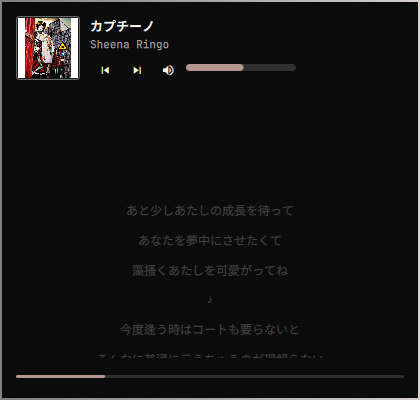

# Super Player

Media controls and synced lyrics for whatever is playing, as an
[Omarchy](https://omarchy.org) bar widget (Quickshell).



- **Any MPRIS player** — Spotify, mpv, browsers, VLC, ... Picked automatically
  (the one that is playing) or pinned to one player in the settings.
- **The line being sung right now** in the bar, plus a hairline progress bar.
- **Popup with real media controls**: previous, play/pause, next, a volume
  slider and mute.
- **Full synced lyrics** from [LRCLIB](https://lrclib.net); click a line to seek
  there.
- **Optional romanization** (Japanese readings, Hangul, Cyrillic, Greek, ...)
  and **translation** to the language of your choice.
- **Theme aware** — colors, spacing and widgets come from the shell theme, so it
  follows theme switches automatically.

## Requirements

- Omarchy with the Quickshell shell (`omarchy-shell`)
- A player that exposes MPRIS (Spotify, mpv, Chromium/Brave, VLC, ...)
- Internet access for the lyrics lookup (LRCLIB) and, when enabled, translation
- Optional: `python3` plus `pykakasi` (best) or `kakasi` for romanization
- Optional: a CJK font if you listen to CJK music (e.g. `noto-fonts-cjk`)

## Install

From the marketplace or straight from git:

```bash
omarchy plugin add https://github.com/enrell/omarchy-super-player --enable
```

From a local clone:

```bash
git clone https://github.com/enrell/omarchy-super-player
cd omarchy-super-player
./install.sh --restart                                   # copy into the shell
omarchy plugin enable io.github.enrell.super-player      # place it in the bar
```

`install.sh` copies the plugin files into
`~/.config/omarchy/plugins/io.github.enrell.super-player/` and prunes files that
are no longer part of the plugin. Without `--restart` it only rescans, which is
enough for `manifest.json` changes but **not** for QML changes.

The widget lands in the right section of the bar. Move it like any other widget:

```bash
omarchy bar move io.github.enrell.super-player --after omarchy.tray
omarchy bar move io.github.enrell.super-player --section center --index 0
```

## Remove

```bash
./install.sh --remove                        # from a clone: disables + deletes the plugin
```

or, without a clone:

```bash
omarchy plugin disable io.github.enrell.super-player
rm -rf ~/.config/omarchy/plugins/io.github.enrell.super-player
omarchy restart shell
```

Optional leftovers from romanization/translation (nothing is installed by the
plugin itself):

```bash
rm -rf ~/.local/share/romanize       # pykakasi installed for romanization
rm -rf ~/.local/share/kakasi ~/.local/bin/kakasi
```

## Usage

| Interaction | Action |
|---|---|
| Left click | open/close the popup |
| Right click | open the popup on its settings page |
| Middle click | play/pause |
| Wheel | volume, with a tooltip showing the new level |
| Hover | tooltip with `track — artist` |

Inside the popup:

| Interaction | Action |
|---|---|
| Hover the cover art | play/pause overlay, click to toggle |
| Previous / next buttons | skip tracks |
| Hover the volume icon | reveals the volume bar next to it; click the icon to mute |
| Volume bar | click or drag to set the level |
| Seek bar (bottom) | click anywhere to jump there, press and drag to scrub |
| Click a lyric line | seek to that line |

Both bars are knobless hairlines that thicken slightly on hover to show they can
be dragged, and they use the same colors as the rest of the shell theme.

The widget hides itself while no MPRIS player is running, and (optionally) while
the current track has no lyrics.

IPC, handy for Hyprland keybinds:

```bash
omarchy-shell super-player toggle        # popup
omarchy-shell super-player open
omarchy-shell super-player close
omarchy-shell super-player settings
omarchy-shell super-player playPause
omarchy-shell super-player next
omarchy-shell super-player previous
omarchy-shell super-player mute
omarchy-shell super-player volumeUp
omarchy-shell super-player volumeDown
omarchy-shell super-player status        # JSON snapshot of what is playing
```

## Settings

Open them by **right-clicking the widget** or with the **gear button** in the
popup. Changes are written to this widget's entry in
`~/.config/omarchy/shell.json`, which the shell hot-reloads (no restart needed):

| Key | Type | Default | Description |
|---|---|---|---|
| `source` | enum | `Auto` | Which player to follow. `Auto` follows whichever player is playing and falls back to the first one available; any other value pins one player |
| `romanize` | enum | `Off` | `Off`, `Replace` (show only the romanized line) or `Below` (romanized line under the original) |
| `translate` | enum | `Off` | `Off` or a language code (`pt-BR`, `en`, `es`, `fr`, `de`, `it`, `ja`, `ko`, `zh-CN`, `ru`, ...) |
| `barLabel` | enum | `Lyric line` | `Lyric line` (translation, else romanization, else the original, falling back to the track title), `Track`, or `Icon only` |
| `maxLabelWidth` | integer | `180` | Width in px before the label starts scrolling |
| `hideWhenNoLyrics` | boolean | `false` | Hide the widget while the track has no lyrics instead of showing the track title |

The same keys work from the CLI:

```bash
omarchy bar set io.github.enrell.super-player source Auto
omarchy bar set io.github.enrell.super-player translate pt-BR
omarchy bar set io.github.enrell.super-player romanize Below
omarchy bar set io.github.enrell.super-player maxLabelWidth 240
```

```json
{
  "id": "io.github.enrell.super-player",
  "source": "Auto",
  "romanize": "Below",
  "translate": "pt-BR",
  "barLabel": "Lyric line",
  "maxLabelWidth": 180,
  "hideWhenNoLyrics": false
}
```

With romanization and translation both on, each line shows the original, then
the romanization, then the translation. The bar label prefers the translation,
then the romanization, then the original.

## How it works

1. **Track**: the service follows MPRIS. `Auto` picks the playing player and
   falls back to the first available; `source` pins one. A track change triggers
   a debounced lookup (250 ms) so the player can finish publishing its metadata.
2. **Lyrics** (in order): exact `GET /api/get` (artist + track + album +
   duration) → filtered `GET /api/search` → free text `GET /api/search?q=`.
   Players like mpv report no artist, and LRCLIB requires one for the exact
   lookup, so those go straight to the free text search. Candidates prefer
   synced lyrics and a duration close to the playing track (≤ 25 s for synced,
   ≤ 10 s for unsynced) to avoid matching live or remix versions. Network
   failures retry twice. Results are cached in memory per track.
3. **Clock**: a 100 ms timer advances the position while playing and re-anchors
   to MPRIS on jumps larger than 1.5 s (seek, loop, restart), when the player
   appears and when a track is already mid-play, so a paused track still
   highlights the right line.
4. **Romanization and translation**: both run once per track over the whole
   lyrics block and are merged into the line list (`romanized`, `translated`).
5. **Rendering**: the card shows the cover art (hover for play/pause), the track
   header with previous/next and the hover-revealed volume bar, the synced lyrics
   with the current line highlighted and centered, and a draggable seek bar.

## External dependencies and network

Nothing is bundled and nothing is installed behind your back.

| Used for | What | Where it goes |
|---|---|---|
| Lyrics | [LRCLIB](https://lrclib.net) public API | `lrclib.net` |
| Translation (optional) | Google Translate public endpoint | `clients5.google.com` |
| Romanization (optional) | `romanize.py` runs `python3` and uses `pykakasi`, `kakasi` or ICU `uconv`, whichever is available | local processes |

Romanization tooling, best first:

| Tool | Covers | Install |
|---|---|---|
| **pykakasi** | Japanese including kanji readings, split into word tokens | `uv pip install --target ~/.local/share/romanize pykakasi` |
| **kakasi** | Japanese including kanji readings (older dictionary, words segmented) | `omarchy pkg add kakasi` (repo `extra`) |
| **uconv** (ICU) | kana, Hangul, Cyrillic, Greek, ... | comes with ICU |

ICU alone maps kanji to *pinyin*, which is wrong for Japanese, so with ICU only
the kana are romanized and the kanji are left alone. Check what the plugin
picked with:

```bash
python3 ~/.config/omarchy/plugins/io.github.enrell.super-player/romanize.py --tool
```

## Development

```bash
./install.sh --restart     # copy the sources and restart the shell
node tests/lrc_test.js     # LRC parser tests
```

`probe.qml` loads the service and the card outside the bar, prints the state and
exits — useful to check a change without restarting the shell:

```bash
ln -sfn /usr/share/omarchy/shell/Commons Commons     # dev only, git-ignored
ln -sfn /usr/share/omarchy/shell/Ui Ui
PROBE_SOURCE=org.mpris.MediaPlayer2.spotify PROBE_TICKS=20 qs -p probe.qml
```

Notes for contributors:

- **QML changes need `omarchy restart shell`.** `omarchy-shell shell
  rescanPlugins` re-reads manifests and re-instantiates widgets, but the running
  shell keeps serving the previously compiled QML.
- Keep the installed plugin a **real directory**: Qt's QML loader gets confused
  by a symlinked plugin directory (stale directory listings, `File name case
  mismatch`).
- Object literals in QML properties need parentheses: `property var x: ({ ... })`.
- `IpcHandler` needs `import Quickshell.Io`, and `show` is a reserved IPC
  function name in Quickshell (it prints the target listing).

## Limitations

- If LRCLIB only has a different version of the track, the popup says
  "No lyrics found on LRCLIB." rather than showing timings that do not match.
- Unsynced lyrics are listed without a highlight (the header shows
  "unsynced lyrics").
- pykakasi's tokenizer still glues some kana-only runs (e.g. `これはつまり` →
  `korehatsumari`); words that contain kanji come out properly split.
- MPRIS has no mute, so mute is implemented as volume 0 with the previous level
  remembered.
- The translation endpoint is undocumented, so it can change or rate limit; when
  it fails the plugin simply keeps the original lyrics.

## License

[MIT](LICENSE). Lyrics come from [LRCLIB](https://lrclib.net) and belong to
their respective authors and publishers.
